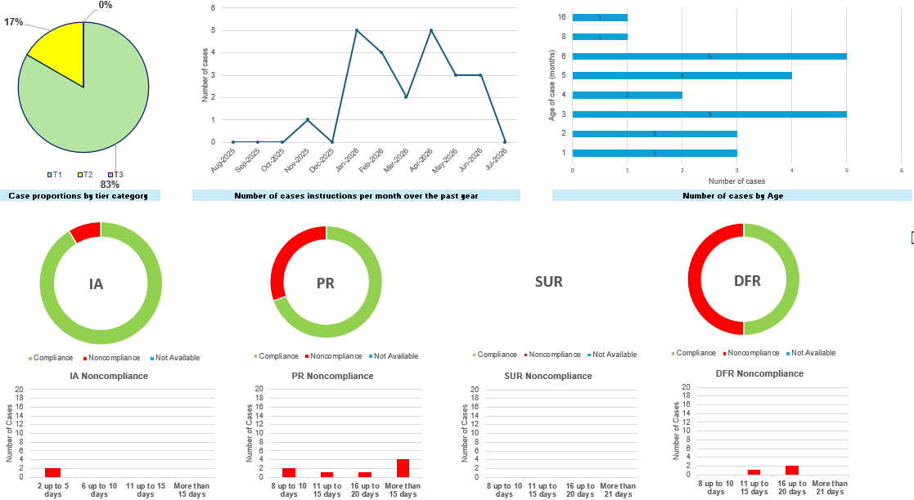
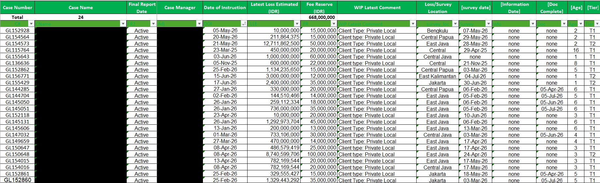
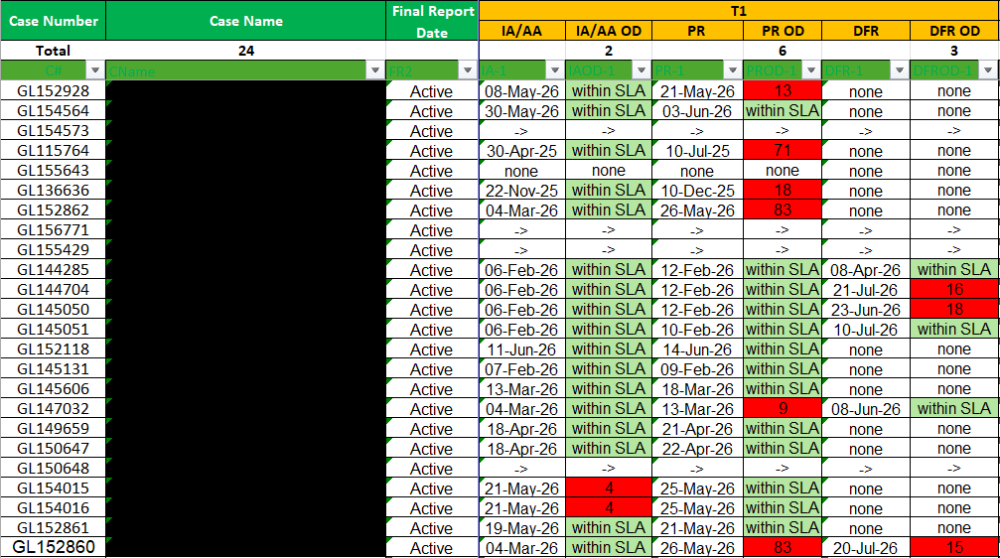
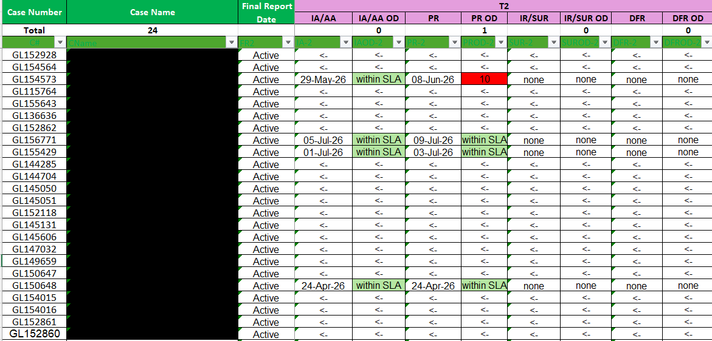
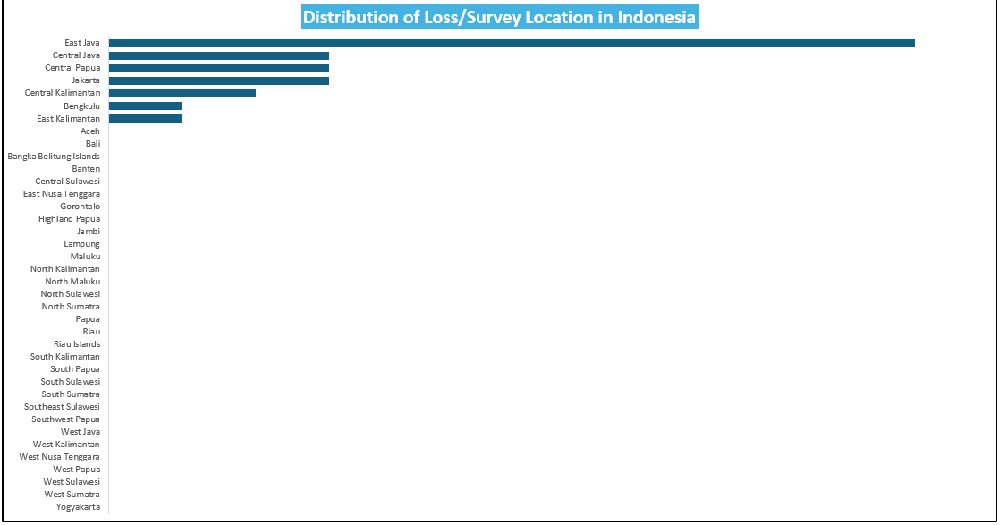

# 📋 Marine Cargo Claims Workflow & Case Management Dashboard

> An automated Microsoft Excel dashboard for managing marine cargo insurance claims, monitoring operational workflows, and tracking Service Level Agreement (SLA) compliance.

---

# 📌 Overview

This project demonstrates the development of an operational workflow and case management dashboard using Microsoft Excel for marine cargo insurance claims.

The dashboard centralizes operational claim data into an interactive management system, enabling adjusters and management to monitor active cases, track claim progress, evaluate SLA compliance, and analyze operational performance.

Originally developed to support daily claim operations, this solution significantly reduced manual monitoring and improved visibility throughout the entire claim handling process.

> **Note:** This repository is shared for portfolio purposes only. All confidential business information has been removed or anonymized.

---

# 🎯 Business Problem

Managing dozens of active insurance claims simultaneously presents several operational challenges.

Without an integrated monitoring system, it becomes difficult to:

- Track active claim cases
- Monitor claim ageing
- Ensure report submission complies with SLA
- Monitor adjuster workload
- Identify overdue activities
- Produce operational summaries for management

Manual monitoring using spreadsheets increased the risk of missed deadlines and reduced operational visibility.

---

# 💡 Solution

Developed an automated Microsoft Excel dashboard that integrates claim management, workflow monitoring, and executive reporting into a single operational tool.

The solution enables users to:

- Track active claims
- Monitor claim workflow
- Measure SLA compliance
- Monitor claim ageing
- Analyze operational workload
- Visualize business performance
- Produce executive summaries automatically

---

# 📈 Key Features

### 📋 Case Management

- Active Claim List
- Case Information
- Survey Location Tracking
- Reserve Monitoring
- Claim Ageing
- Document Completion Status

### ⏱ Workflow Monitoring

- Initial Advice (IA)
- Preliminary Report (PR)
- Survey Report (SUR)
- Detailed Final Report (DFR)
- SLA Compliance
- Overdue Monitoring

### 📊 Operational Dashboard

- Case Distribution
- Monthly Case Trend
- Ageing Analysis
- Tier Distribution
- Adjuster Compliance
- Executive KPI Summary

### 🌍 Geographic Analysis

- Survey Location Distribution
- Province-based Operational Analysis

---

# 📊 Dashboard Preview

## 1. Operational Performance Dashboard

Executive dashboard providing an overview of operational KPIs, including workload distribution, monthly claim trends, case ageing, tier distribution, and adjuster compliance.

---

## 2. Case Management Dashboard

Centralized operational workspace used to manage active marine cargo claims, monitor claim status, survey locations, reserves, document completion, and ageing.

---

## 3. SLA Monitoring Dashboard (Tier 1)

Workflow monitoring dashboard for Tier 1 claims, tracking compliance with Initial Advice (IA), Preliminary Report (PR), and Detailed Final Report (DFR) Service Level Agreements.

---

## 4. SLA Monitoring Dashboard (Tier 2)

Dedicated workflow monitoring for Tier 2 claims with independent SLA tracking to support different claim handling processes.

---

## 5. Survey Location Distribution

Geographic visualization showing the distribution of survey and loss locations across Indonesian provinces, supporting operational planning and workload analysis.

---

# 📈 Business Value

This dashboard improved operational performance by:

- Centralizing claim information
- Reducing manual monitoring activities
- Improving SLA visibility
- Supporting adjuster workload management
- Monitoring overdue reports
- Providing executive-level operational reporting
- Improving operational decision-making

---

# 🛠 Technologies Used

- Microsoft Excel
- Advanced Excel Formulas
- Pivot Tables
- Pivot Charts
- Conditional Formatting
- Dashboard Design
- Data Visualization
- Operational Reporting
- KPI Monitoring

---

# 💼 Skills Demonstrated

- Business Intelligence
- Data Analysis
- Dashboard Development
- Claims Management
- Workflow Automation
- KPI Development
- Operational Reporting
- Microsoft Excel
- Data Visualization
- Process Improvement

---

# 🚀 Future Improvements

Future enhancements may include:

- SQL Database Integration
- Power BI Dashboard
- Python Data Processing
- Automated ETL Pipeline
- Streamlit Web Dashboard
- Email Notification System
- Interactive KPI Dashboard
- Predictive Workload Analytics

---

# 📄 Disclaimer

This repository is intended for educational and portfolio purposes only.

All confidential information, including customer names, claim numbers, financial figures, and operational data, has been removed or anonymized. The dashboard demonstrates workflow automation, operational reporting, KPI monitoring, and data visualization techniques without disclosing proprietary business information.

---

# 👨‍💻 Author

**Ahmad Subari**

Claims Analyst | Marine Cargo Surveyor | Data Analytics Enthusiast

- 💼 LinkedIn: https://www.linkedin.com/in/ahmadsubari23
- 💻 GitHub: https://github.com/ahmadsubari23
- 📧 Email: ahmad.subari23@gmail.com

---

⭐ If you found this project interesting, please consider giving it a ⭐.
